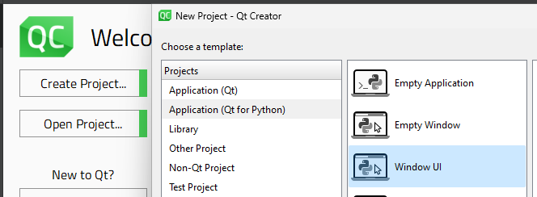

# PyQt6 with .ui Files

## Install Python
[Link](https://www.python.org/ftp/python/3.12.2/python-3.12.2-amd64.exe)
* use admin
* add to PATH
* disable path limit

## Install Python Modules
* in terminal: `python -m pip install pyls pyqt6 pyside6`

## Install Qt
[DL Page](https://www.qt.io/download-qt-installer-oss) or [Direct Download](https://d13lb3tujbc8s0.cloudfront.net/onlineinstallers/qt-unified-windows-x64-4.7.0-online.exe)
* get a license if needed (both packages): https://www.qt.io/qt-educational-license#application, verify account
* log in, \<next>
* (you might not get this page) agree to license and select "I'm an individual...", \<next>
* ~welcome~, \<next>
* default location, select "Custom Installation" button, deselect "associate common file types...", \<next>
* deselect "prerelease" option on right, select "LTS" option, \<filter>
* leave default component selections, add Qt > Qt 6.6.2 > MSVC 2019 XX-bit, add Qt > Qt 6.6.2 > MinGW, add Qt > Qt 6.6.2 > Qt 5 Compatability mode
* (optional) I installed all of Qt > Qt 6.6.2, feel free to select more in there if you want
* Qt Creator 12.0.2 should be in the list, \<next>
* agree to license, \<next>
* ~Qt~, \<next>, \<install>
* wait for like...ever, exit

## Prepare environment
`python -m venv venv`
`.\venv\Scripts\python.exe -m pip install pyqt6 pyside6 pyls`

## Open the|new project
new:  
* Open Qt Creator  
*   
* Enjoy the tools!

open:  
* `.\venv\Scripts\python.exe -m pip install pyqt6 pyside6 pyls`
* add your existing files to the root directory (where the `venv` directory is)  
* `.\venv\Scripts\pyuic6.exe form.ui -o ui_form.py`
* update your files and connect the UI variables to your python code
* launch it with `.\venv\Scripts\python.exe main.py`
